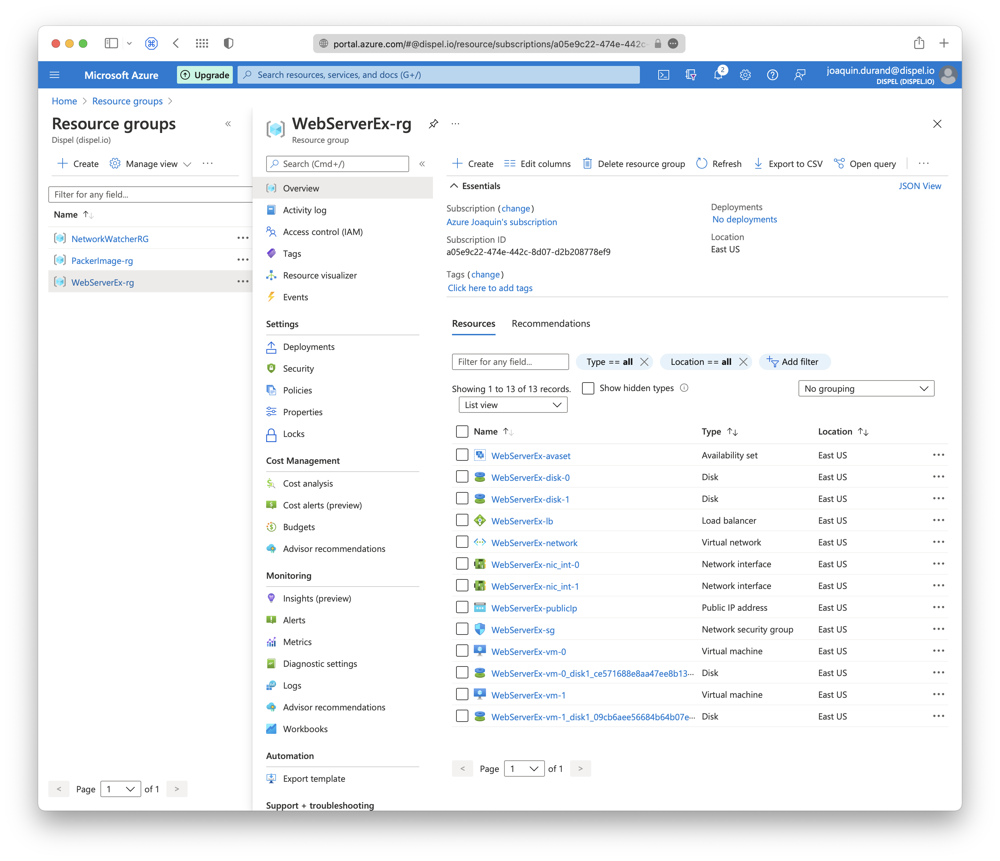

# Project Log

This file contains the steps that I made to complete this project.

## Policy definition

See the file **./policies.json**. The only required policy is to enforce the existence of at least one tag.
Code to apply the policy:

```
az policy definition create --name "Tagging-Policy" --display-name "Require Tagging Policy" --description "This policy requires everybody to have tags" --rules policies.json --mode All
```

See [this question](https://knowledge.udacity.com/questions/525456).

Resulting output:

```
project  az policy definition create --name "Tagging-Policy" --display-name "Require Tagging Policy" --description "This policy requires everybody to have tags" --rules policies.json --mode All
{
  "description": "This policy requires everybody to have tags",
  "displayName": "Require Tagging Policy",
  "id": "/subscriptions/a05e9c22-474e-442c-8d07-d2b208778ef9/providers/Microsoft.Authorization/policyDefinitions/Tagging-Policy",
  "metadata": {
	 "createdBy": "ae286afc-acf3-444b-b957-20cf56812b11",
	 "createdOn": "2021-11-01T17:30:38.7070887Z",
	 "updatedBy": "ae286afc-acf3-444b-b957-20cf56812b11",
	 "updatedOn": "2021-11-01T17:38:18.2693936Z"
  },
  "mode": "All",
  "name": "Tagging-Policy",
  "parameters": null,
  "policyRule": {
	 "if": {
		"exists": false,
		"field": "tags"
	 },
	 "then": {
		"effect": "deny"
	 }
  },
  "policyType": "Custom",
  "type": "Microsoft.Authorization/policyDefinitions"
}
```
```
project  az policy assignment list
[
  {
	 "description": null,
	 "displayName": null,
	 "enforcementMode": "Default",
	 "id": "/subscriptions/a05e9c22-474e-442c-8d07-d2b208778ef9/providers/Microsoft.Authorization/policyAssignments/kmmBqAyCQBCcLeDeG8myuA",
	 "identity": null,
	 "location": null,
	 "metadata": {
		"createdBy": "ae286afc-acf3-444b-b957-20cf56812b11",
		"createdOn": "2021-10-25T16:50:34.2278326Z",
		"updatedBy": null,
		"updatedOn": null
	 },
	 "name": "kmmBqAyCQBCcLeDeG8myuA",
	 "nonComplianceMessages": null,
	 "notScopes": null,
	 "parameters": null,
	 "policyDefinitionId": "/subscriptions/a05e9c22-474e-442c-8d07-d2b208778ef9/providers/Microsoft.Authorization/policyDefinitions/LinuxPasswordPolicy",
	 "scope": "/subscriptions/a05e9c22-474e-442c-8d07-d2b208778ef9",
	 "type": "Microsoft.Authorization/policyAssignments"
  },
  {
	 "description": "This is the default set of policies monitored by Azure Security Center. It was automatically assigned as part of onboarding to Security Center. The default assignment contains only audit policies. For more information please visit https://aka.ms/ascpolicies",
	 "displayName": "ASC Default (subscription: a05e9c22-474e-442c-8d07-d2b208778ef9)",
	 "enforcementMode": "Default",
	 "id": "/subscriptions/a05e9c22-474e-442c-8d07-d2b208778ef9/providers/Microsoft.Authorization/policyAssignments/SecurityCenterBuiltIn",
	 "identity": null,
	 "location": null,
	 "metadata": {
		"assignedBy": "Security Center",
		"createdBy": "553df8bc-f67a-4149-b05a-9739f6cc8b15",
		"createdOn": "2021-10-22T17:19:00.5667885Z",
		"excludedOutOfTheBoxStandards": [
		  "PCI DSS 3.2.1",
		  "ISO 27001",
		  "SOC TSP"
		],
		"updatedBy": null,
		"updatedOn": null
	 },
	 "name": "SecurityCenterBuiltIn",
	 "nonComplianceMessages": null,
	 "notScopes": null,
	 "parameters": {},
	 "policyDefinitionId": "/providers/Microsoft.Authorization/policySetDefinitions/1f3afdf9-d0c9-4c3d-847f-89da613e70a8",
	 "scope": "/subscriptions/a05e9c22-474e-442c-8d07-d2b208778ef9",
	 "type": "Microsoft.Authorization/policyAssignments"
  }
]
```

Screenshot of the policy in Azure:


## Packer Image

The important lesson was that the image should reside in different Azure resource group than the Terraform template. ***Important:*** the variables *"client_id"*, *"client_secret"*, and *"subscription_id"* must be obtained from Azure.
See file **./packer/server.json**.
Note that *managed_image_resource_group_name* is hardcoded to *PackerImage-rg* and it must preexist in Azure.

### Packer output

```
packer  packer build server.json
azure-arm: output will be in this color.

==> azure-arm: Running builder ...
==> azure-arm: Getting tokens using client secret
==> azure-arm: Getting tokens using client secret
	 azure-arm: Creating Azure Resource Manager (ARM) client ...
==> azure-arm: WARNING: Zone resiliency may not be supported in East US, checkout the docs at https://docs.microsoft.com/en-us/azure/availability-zones/
==> azure-arm: Getting source image id for the deployment ...
==> azure-arm:  -> SourceImageName: '/subscriptions/a05e9c22-474e-442c-8d07-d2b208778ef9/providers/Microsoft.Compute/locations/East US/publishers/Canonical/ArtifactTypes/vmimage/offers/UbuntuServer/skus/18.04-LTS/versions/latest'
==> azure-arm: Creating resource group ...
==> azure-arm:  -> ResourceGroupName : 'pkr-Resource-Group-2n285ewpkm'
==> azure-arm:  -> Location          : 'East US'
==> azure-arm:  -> Tags              :
==> azure-arm: Validating deployment template ...
==> azure-arm:  -> ResourceGroupName : 'pkr-Resource-Group-2n285ewpkm'
==> azure-arm:  -> DeploymentName    : 'pkrdp2n285ewpkm'
==> azure-arm: Deploying deployment template ...
==> azure-arm:  -> ResourceGroupName : 'pkr-Resource-Group-2n285ewpkm'
==> azure-arm:  -> DeploymentName    : 'pkrdp2n285ewpkm'
==> azure-arm:
==> azure-arm: Getting the VM's IP address ...
==> azure-arm:  -> ResourceGroupName   : 'pkr-Resource-Group-2n285ewpkm'
==> azure-arm:  -> PublicIPAddressName : 'pkrip2n285ewpkm'
==> azure-arm:  -> NicName             : 'pkrni2n285ewpkm'
==> azure-arm:  -> Network Connection  : 'PublicEndpoint'
==> azure-arm:  -> IP Address          : '20.120.95.131'
==> azure-arm: Waiting for SSH to become available...
==> azure-arm: Connected to SSH!
==> azure-arm: Provisioning with shell script: /var/folders/nd/j5st0_411qj53nymq58bst640000gn/T/packer-shell287799332
==> azure-arm: + echo Hello, World!
==> azure-arm: + nohup busybox httpd -f -p 80
==> azure-arm: Querying the machine's properties ...
==> azure-arm:  -> ResourceGroupName : 'pkr-Resource-Group-2n285ewpkm'
==> azure-arm:  -> ComputeName       : 'pkrvm2n285ewpkm'
==> azure-arm:  -> Managed OS Disk   : '/subscriptions/a05e9c22-474e-442c-8d07-d2b208778ef9/resourceGroups/pkr-Resource-Group-2n285ewpkm/providers/Microsoft.Compute/disks/pkros2n285ewpkm'
==> azure-arm: Querying the machine's additional disks properties ...
==> azure-arm:  -> ResourceGroupName : 'pkr-Resource-Group-2n285ewpkm'
==> azure-arm:  -> ComputeName       : 'pkrvm2n285ewpkm'
==> azure-arm: Powering off machine ...
==> azure-arm:  -> ResourceGroupName : 'pkr-Resource-Group-2n285ewpkm'
==> azure-arm:  -> ComputeName       : 'pkrvm2n285ewpkm'
==> azure-arm: Capturing image ...
==> azure-arm:  -> Compute ResourceGroupName : 'pkr-Resource-Group-2n285ewpkm'
==> azure-arm:  -> Compute Name              : 'pkrvm2n285ewpkm'
==> azure-arm:  -> Compute Location          : 'East US'
==> azure-arm:  -> Image ResourceGroupName   : 'PackerImage-rg'
==> azure-arm:  -> Image Name                : 'WebServerImage'
==> azure-arm:  -> Image Location            : 'East US'
==> azure-arm: 
==> azure-arm: Deleting individual resources ...
==> azure-arm: Adding to deletion queue -> Microsoft.Compute/virtualMachines : 'pkrvm2n285ewpkm'
==> azure-arm: Adding to deletion queue -> Microsoft.Network/networkInterfaces : 'pkrni2n285ewpkm'
==> azure-arm: Adding to deletion queue -> Microsoft.Network/virtualNetworks : 'pkrvn2n285ewpkm'
==> azure-arm: Adding to deletion queue -> Microsoft.Network/publicIPAddresses : 'pkrip2n285ewpkm'
==> azure-arm: Waiting for deletion of all resources...
==> azure-arm: Attempting deletion -> Microsoft.Network/virtualNetworks : 'pkrvn2n285ewpkm'
==> azure-arm: Attempting deletion -> Microsoft.Network/publicIPAddresses : 'pkrip2n285ewpkm'
==> azure-arm: Attempting deletion -> Microsoft.Compute/virtualMachines : 'pkrvm2n285ewpkm'
==> azure-arm: Attempting deletion -> Microsoft.Network/networkInterfaces : 'pkrni2n285ewpkm'
==> azure-arm: Error deleting resource. Will retry.
==> azure-arm: Name: pkrip2n285ewpkm
==> azure-arm: Error: network.PublicIPAddressesClient#Delete: Failure sending request: StatusCode=0 -- Original Error: Code="PublicIPAddressCannotBeDeleted" Message="Public IP address /subscriptions/a05e9c22-474e-442c-8d07-d2b208778ef9/resourceGroups/pkr-Resource-Group-2n285ewpkm/providers/Microsoft.Network/publicIPAddresses/pkrip2n285ewpkm can not be deleted since it is still allocated to resource /subscriptions/a05e9c22-474e-442c-8d07-d2b208778ef9/resourceGroups/pkr-Resource-Group-2n285ewpkm/providers/Microsoft.Network/networkInterfaces/pkrni2n285ewpkm/ipConfigurations/ipconfig. In order to delete the public IP, disassociate/detach the Public IP address from the resource.  To learn how to do this, see aka.ms/deletepublicip." Details=[]
==> azure-arm:
==> azure-arm: Error deleting resource. Will retry.
==> azure-arm: Name: pkrvn2n285ewpkm
==> azure-arm: Error: network.VirtualNetworksClient#Delete: Failure sending request: StatusCode=0 -- Original Error: Code="InUseSubnetCannotBeDeleted" Message="Subnet pkrsn2n285ewpkm is in use by /subscriptions/a05e9c22-474e-442c-8d07-d2b208778ef9/resourceGroups/pkr-Resource-Group-2n285ewpkm/providers/Microsoft.Network/networkInterfaces/pkrni2n285ewpkm/ipConfigurations/ipconfig and cannot be deleted. In order to delete the subnet, delete all the resources within the subnet. See aka.ms/deletesubnet." Details=[]
==> azure-arm:
==> azure-arm: Attempting deletion -> Microsoft.Network/publicIPAddresses : 'pkrip2n285ewpkm'
==> azure-arm: Attempting deletion -> Microsoft.Network/virtualNetworks : 'pkrvn2n285ewpkm'
==> azure-arm:  Deleting -> Microsoft.Compute/disks : '/subscriptions/a05e9c22-474e-442c-8d07-d2b208778ef9/resourceGroups/pkr-Resource-Group-2n285ewpkm/providers/Microsoft.Compute/disks/pkros2n285ewpkm'
==> azure-arm: Removing the created Deployment object: 'pkrdp2n285ewpkm'
==> azure-arm: 
==> azure-arm: Cleanup requested, deleting resource group ...
==> azure-arm: Resource group has been deleted.
Build 'azure-arm' finished after 5 minutes 23 seconds.

==> Wait completed after 5 minutes 23 seconds

==> Builds finished. The artifacts of successful builds are:
--> azure-arm: Azure.ResourceManagement.VMImage:

OSType: Linux
ManagedImageResourceGroupName: PackerImage-rg
ManagedImageName: WebServerImage
ManagedImageId: /subscriptions/a05e9c22-474e-442c-8d07-d2b208778ef9/resourceGroups/PackerImage-rg/providers/Microsoft.Compute/images/WebServerImage
ManagedImageLocation: East US
```

## Terraform

### Configuration

For the variables see file **./tf/vars.tf**.
The terraform variables are:

- **prefix** defaults to *"WebServerEx"*
- **location** defaults to *"eastus"*
- **username** defaults to *"joaquin.d"*
- **password** defaults to *"j0aqu1n__0"*
- **packer_image_rg** defaults to *"PackerImage-rg"*
- **packer_image** defaults to *"WebServerImage"*
- **number_vms**  defaults to *1*

The main module is in the file: **./tf/main.tf**.

### Terraform output

```
tf  terraform plan -out solution.plan
azurerm_resource_group.main: Refreshing state... [id=/subscriptions/a05e9c22-474e-442c-8d07-d2b208778ef9/resourceGroups/WebServerEx-rg]
azurerm_availability_set.avail_set: Refreshing state... [id=/subscriptions/a05e9c22-474e-442c-8d07-d2b208778ef9/resourceGroups/WebServerEx-rg/providers/Microsoft.Compute/availabilitySets/WebServerEx-avaset]
azurerm_public_ip.public_ip: Refreshing state... [id=/subscriptions/a05e9c22-474e-442c-8d07-d2b208778ef9/resourceGroups/WebServerEx-rg/providers/Microsoft.Network/publicIPAddresses/WebServerEx-publicIp]
azurerm_virtual_network.vnet: Refreshing state... [id=/subscriptions/a05e9c22-474e-442c-8d07-d2b208778ef9/resourceGroups/WebServerEx-rg/providers/Microsoft.Network/virtualNetworks/WebServerEx-network]
azurerm_network_security_group.security: Refreshing state... [id=/subscriptions/a05e9c22-474e-442c-8d07-d2b208778ef9/resourceGroups/WebServerEx-rg/providers/Microsoft.Network/networkSecurityGroups/WebServerEx-sg]
azurerm_subnet.internal: Refreshing state... [id=/subscriptions/a05e9c22-474e-442c-8d07-d2b208778ef9/resourceGroups/WebServerEx-rg/providers/Microsoft.Network/virtualNetworks/WebServerEx-network/subnets/internal]
azurerm_subnet_network_security_group_association.main: Refreshing state... [id=/subscriptions/a05e9c22-474e-442c-8d07-d2b208778ef9/resourceGroups/WebServerEx-rg/providers/Microsoft.Network/virtualNetworks/WebServerEx-network/subnets/internal]

Note: Objects have changed outside of Terraform

Terraform detected the following changes made outside of Terraform since the last "terraform apply":

  # azurerm_virtual_network.vnet has been deleted
  - resource "azurerm_virtual_network" "vnet" {
		- address_space         = [
			 - "10.0.2.0/24",
		  ] -> null
		- dns_servers           = [] -> null
		- guid                  = "11977e28-0ff7-406d-8f2e-93fbd3956b6a" -> null
		- id                    = "/subscriptions/a05e9c22-474e-442c-8d07-d2b208778ef9/resourceGroups/WebServerEx-rg/providers/Microsoft.Network/virtualNetworks/WebServerEx-network" -> null
		- location              = "eastus" -> null
		- name                  = "WebServerEx-network" -> null
		- resource_group_name   = "WebServerEx-rg" -> null
		- subnet                = [] -> null
		- vm_protection_enabled = false -> null
	 }
  # azurerm_subnet_network_security_group_association.main has been deleted
  - resource "azurerm_subnet_network_security_group_association" "main" {
		- id                        = "/subscriptions/a05e9c22-474e-442c-8d07-d2b208778ef9/resourceGroups/WebServerEx-rg/providers/Microsoft.Network/virtualNetworks/WebServerEx-network/subnets/internal" -> null
		- network_security_group_id = "/subscriptions/a05e9c22-474e-442c-8d07-d2b208778ef9/resourceGroups/WebServerEx-rg/providers/Microsoft.Network/networkSecurityGroups/WebServerEx-sg" -> null
		- subnet_id                 = "/subscriptions/a05e9c22-474e-442c-8d07-d2b208778ef9/resourceGroups/WebServerEx-rg/providers/Microsoft.Network/virtualNetworks/WebServerEx-network/subnets/internal" -> null
	 }
  # azurerm_network_security_group.security has been deleted
  - resource "azurerm_network_security_group" "security" {
		- id                  = "/subscriptions/a05e9c22-474e-442c-8d07-d2b208778ef9/resourceGroups/WebServerEx-rg/providers/Microsoft.Network/networkSecurityGroups/WebServerEx-sg" -> null
		- location            = "eastus" -> null
		- name                = "WebServerEx-sg" -> null
		- resource_group_name = "WebServerEx-rg" -> null
		- security_rule       = [
			 - {
				  - access                                     = "Allow"
				  - description                                = ""
				  - destination_address_prefix                 = "VirtualNetwork"
				  - destination_address_prefixes               = []
				  - destination_application_security_group_ids = []
				  - destination_port_range                     = "*"
				  - destination_port_ranges                    = []
				  - direction                                  = "Inbound"
				  - name                                       = "VMAccess"
				  - priority                                   = 200
				  - protocol                                   = "*"
				  - source_address_prefix                      = "VirtualNetwork"
				  - source_address_prefixes                    = []
				  - source_application_security_group_ids      = []
				  - source_port_range                          = "*"
				  - source_port_ranges                         = []
				},
			 - {
				  - access                                     = "Deny"
				  - description                                = ""
				  - destination_address_prefix                 = "*"
				  - destination_address_prefixes               = []
				  - destination_application_security_group_ids = []
				  - destination_port_range                     = "*"
				  - destination_port_ranges                    = []
				  - direction                                  = "Inbound"
				  - name                                       = "NoInternetIn"
				  - priority                                   = 100
				  - protocol                                   = "*"
				  - source_address_prefix                      = "*"
				  - source_address_prefixes                    = []
				  - source_application_security_group_ids      = []
				  - source_port_range                          = "*"
				  - source_port_ranges                         = []
				},
		  ] -> null
		- tags                = {
			 - "lesson" = "1"
		  } -> null
	 }
  # azurerm_resource_group.main has been deleted
  - resource "azurerm_resource_group" "main" {
		- id       = "/subscriptions/a05e9c22-474e-442c-8d07-d2b208778ef9/resourceGroups/WebServerEx-rg" -> null
		- location = "eastus" -> null
		- name     = "WebServerEx-rg" -> null
	 }
  # azurerm_availability_set.avail_set has been deleted
  - resource "azurerm_availability_set" "avail_set" {
		- id                           = "/subscriptions/a05e9c22-474e-442c-8d07-d2b208778ef9/resourceGroups/WebServerEx-rg/providers/Microsoft.Compute/availabilitySets/WebServerEx-avaset" -> null
		- location                     = "eastus" -> null
		- managed                      = true -> null
		- name                         = "WebServerEx-avaset" -> null
		- platform_fault_domain_count  = 3 -> null
		- platform_update_domain_count = 5 -> null
		- resource_group_name          = "WebServerEx-rg" -> null
		- tags                         = {
			 - "lesson" = "1"
		  } -> null
	 }
  # azurerm_public_ip.public_ip has been deleted
  - resource "azurerm_public_ip" "public_ip" {
		- allocation_method       = "Static" -> null
		- availability_zone       = "No-Zone" -> null
		- id                      = "/subscriptions/a05e9c22-474e-442c-8d07-d2b208778ef9/resourceGroups/WebServerEx-rg/providers/Microsoft.Network/publicIPAddresses/WebServerEx-publicIp" -> null
		- idle_timeout_in_minutes = 4 -> null
		- ip_address              = "20.120.109.118" -> null
		- ip_version              = "IPv4" -> null
		- location                = "eastus" -> null
		- name                    = "WebServerEx-publicIp" -> null
		- resource_group_name     = "WebServerEx-rg" -> null
		- sku                     = "Basic" -> null
		- sku_tier                = "Regional" -> null
		- tags                    = {
			 - "lesson" = "1"
		  } -> null
		- zones                   = [] -> null
	 }
  # azurerm_subnet.internal has been deleted
  - resource "azurerm_subnet" "internal" {
		- address_prefix                                 = "10.0.2.0/24" -> null
		- address_prefixes                               = [
			 - "10.0.2.0/24",
		  ] -> null
		- enforce_private_link_endpoint_network_policies = false -> null
		- enforce_private_link_service_network_policies  = false -> null
		- id                                             = "/subscriptions/a05e9c22-474e-442c-8d07-d2b208778ef9/resourceGroups/WebServerEx-rg/providers/Microsoft.Network/virtualNetworks/WebServerEx-network/subnets/internal" -> null
		- name                                           = "internal" -> null
		- resource_group_name                            = "WebServerEx-rg" -> null
		- virtual_network_name                           = "WebServerEx-network" -> null
	 }

Unless you have made equivalent changes to your configuration, or ignored the relevant attributes using ignore_changes, the following plan may include actions to undo or
respond to these changes.

───────────────────────────────────────────────────────────────────────────────────────────────────────────────────────────────────────────────────────────────────────────

Terraform used the selected providers to generate the following execution plan. Resource actions are indicated with the following symbols:
  + create

Terraform will perform the following actions:

  # azurerm_availability_set.avail_set will be created
  + resource "azurerm_availability_set" "avail_set" {
		+ id                           = (known after apply)
		+ location                     = "eastus"
		+ managed                      = true
		+ name                         = "WebServerEx-avaset"
		+ platform_fault_domain_count  = 3
		+ platform_update_domain_count = 5
		+ resource_group_name          = "WebServerEx-rg"
		+ tags                         = {
			 + "lesson" = "1"
		  }
	 }

  # azurerm_lb.load_balancer will be created
  + resource "azurerm_lb" "load_balancer" {
		+ id                   = (known after apply)
		+ location             = "eastus"
		+ name                 = "WebServerEx-lb"
		+ private_ip_address   = (known after apply)
		+ private_ip_addresses = (known after apply)
		+ resource_group_name  = "WebServerEx-rg"
		+ sku                  = "Basic"
		+ sku_tier             = "Regional"
		+ tags                 = {
			 + "lesson" = "1"
		  }

		+ frontend_ip_configuration {
			 + availability_zone                                  = (known after apply)
			 + gateway_load_balancer_frontend_ip_configuration_id = (known after apply)
			 + id                                                 = (known after apply)
			 + inbound_nat_rules                                  = (known after apply)
			 + load_balancer_rules                                = (known after apply)
			 + name                                               = "WebServerEx-PublicIP"
			 + outbound_rules                                     = (known after apply)
			 + private_ip_address                                 = (known after apply)
			 + private_ip_address_allocation                      = (known after apply)
			 + private_ip_address_version                         = (known after apply)
			 + public_ip_address_id                               = (known after apply)
			 + public_ip_prefix_id                                = (known after apply)
			 + subnet_id                                          = (known after apply)
			 + zones                                              = (known after apply)
		  }
	 }

  # azurerm_lb_backend_address_pool.address_pool will be created
  + resource "azurerm_lb_backend_address_pool" "address_pool" {
		+ backend_ip_configurations = (known after apply)
		+ id                        = (known after apply)
		+ load_balancing_rules      = (known after apply)
		+ loadbalancer_id           = (known after apply)
		+ name                      = "WebServerEx-bap"
		+ outbound_rules            = (known after apply)
		+ resource_group_name       = (known after apply)
	 }

  # azurerm_linux_virtual_machine.vm[0] will be created
  + resource "azurerm_linux_virtual_machine" "vm" {
		+ admin_password                  = (sensitive value)
		+ admin_username                  = "joaquin.d"
		+ allow_extension_operations      = true
		+ availability_set_id             = (known after apply)
		+ computer_name                   = (known after apply)
		+ disable_password_authentication = false
		+ extensions_time_budget          = "PT1H30M"
		+ id                              = (known after apply)
		+ location                        = "eastus"
		+ max_bid_price                   = -1
		+ name                            = "WebServerEx-vm-0"
		+ network_interface_ids           = (known after apply)
		+ platform_fault_domain           = -1
		+ priority                        = "Regular"
		+ private_ip_address              = (known after apply)
		+ private_ip_addresses            = (known after apply)
		+ provision_vm_agent              = true
		+ public_ip_address               = (known after apply)
		+ public_ip_addresses             = (known after apply)
		+ resource_group_name             = "WebServerEx-rg"
		+ size                            = "Standard_B1s"
		+ source_image_id                 = "/subscriptions/a05e9c22-474e-442c-8d07-d2b208778ef9/resourceGroups/PackerImage-rg/providers/Microsoft.Compute/images/WebServerImage"
		+ tags                            = {
			 + "lesson" = "1"
		  }
		+ virtual_machine_id              = (known after apply)
		+ zone                            = (known after apply)

		+ os_disk {
			 + caching                   = "ReadWrite"
			 + disk_size_gb              = (known after apply)
			 + name                      = (known after apply)
			 + storage_account_type      = "Standard_LRS"
			 + write_accelerator_enabled = false
		  }
	 }

  # azurerm_managed_disk.disk[0] will be created
  + resource "azurerm_managed_disk" "disk" {
		+ create_option        = "Empty"
		+ disk_iops_read_write = (known after apply)
		+ disk_mbps_read_write = (known after apply)
		+ disk_size_gb         = 1
		+ id                   = (known after apply)
		+ location             = "eastus"
		+ logical_sector_size  = (known after apply)
		+ max_shares           = (known after apply)
		+ name                 = "WebServerEx-disk-0"
		+ resource_group_name  = "WebServerEx-rg"
		+ source_uri           = (known after apply)
		+ storage_account_type = "Standard_LRS"
		+ tags                 = {
			 + "lesson" = "1"
		  }
		+ tier                 = (known after apply)
	 }

  # azurerm_network_interface.internal[0] will be created
  + resource "azurerm_network_interface" "internal" {
		+ applied_dns_servers           = (known after apply)
		+ dns_servers                   = (known after apply)
		+ enable_accelerated_networking = false
		+ enable_ip_forwarding          = false
		+ id                            = (known after apply)
		+ internal_dns_name_label       = (known after apply)
		+ internal_domain_name_suffix   = (known after apply)
		+ location                      = "eastus"
		+ mac_address                   = (known after apply)
		+ name                          = "WebServerEx-nic_int-0"
		+ private_ip_address            = (known after apply)
		+ private_ip_addresses          = (known after apply)
		+ resource_group_name           = "WebServerEx-rg"
		+ tags                          = {
			 + "lesson" = "1"
		  }
		+ virtual_machine_id            = (known after apply)

		+ ip_configuration {
			 + gateway_load_balancer_frontend_ip_configuration_id = (known after apply)
			 + name                                               = "internal"
			 + primary                                            = (known after apply)
			 + private_ip_address                                 = (known after apply)
			 + private_ip_address_allocation                      = "dynamic"
			 + private_ip_address_version                         = "IPv4"
			 + subnet_id                                          = (known after apply)
		  }
	 }

  # azurerm_network_interface_backend_address_pool_association.pool_assoc[0] will be created
  + resource "azurerm_network_interface_backend_address_pool_association" "pool_assoc" {
		+ backend_address_pool_id = (known after apply)
		+ id                      = (known after apply)
		+ ip_configuration_name   = "internal"
		+ network_interface_id    = (known after apply)
	 }

  # azurerm_network_security_group.security will be created
  + resource "azurerm_network_security_group" "security" {
		+ id                  = (known after apply)
		+ location            = "eastus"
		+ name                = "WebServerEx-sg"
		+ resource_group_name = "WebServerEx-rg"
		+ security_rule       = [
			 + {
				  + access                                     = "Allow"
				  + description                                = ""
				  + destination_address_prefix                 = "VirtualNetwork"
				  + destination_address_prefixes               = []
				  + destination_application_security_group_ids = []
				  + destination_port_range                     = "*"
				  + destination_port_ranges                    = []
				  + direction                                  = "Inbound"
				  + name                                       = "VMAccess"
				  + priority                                   = 200
				  + protocol                                   = "*"
				  + source_address_prefix                      = "VirtualNetwork"
				  + source_address_prefixes                    = []
				  + source_application_security_group_ids      = []
				  + source_port_range                          = "*"
				  + source_port_ranges                         = []
				},
			 + {
				  + access                                     = "Deny"
				  + description                                = ""
				  + destination_address_prefix                 = "*"
				  + destination_address_prefixes               = []
				  + destination_application_security_group_ids = []
				  + destination_port_range                     = "*"
				  + destination_port_ranges                    = []
				  + direction                                  = "Inbound"
				  + name                                       = "NoInternetIn"
				  + priority                                   = 100
				  + protocol                                   = "*"
				  + source_address_prefix                      = "*"
				  + source_address_prefixes                    = []
				  + source_application_security_group_ids      = []
				  + source_port_range                          = "*"
				  + source_port_ranges                         = []
				},
		  ]
		+ tags                = {
			 + "lesson" = "1"
		  }
	 }

  # azurerm_public_ip.public_ip will be created
  + resource "azurerm_public_ip" "public_ip" {
		+ allocation_method       = "Static"
		+ availability_zone       = (known after apply)
		+ fqdn                    = (known after apply)
		+ id                      = (known after apply)
		+ idle_timeout_in_minutes = 4
		+ ip_address              = (known after apply)
		+ ip_version              = "IPv4"
		+ location                = "eastus"
		+ name                    = "WebServerEx-publicIp"
		+ resource_group_name     = "WebServerEx-rg"
		+ sku                     = "Basic"
		+ sku_tier                = "Regional"
		+ tags                    = {
			 + "lesson" = "1"
		  }
		+ zones                   = (known after apply)
	 }

  # azurerm_resource_group.main will be created
  + resource "azurerm_resource_group" "main" {
		+ id       = (known after apply)
		+ location = "eastus"
		+ name     = "WebServerEx-rg"
	 }

  # azurerm_subnet.internal will be created
  + resource "azurerm_subnet" "internal" {
		+ address_prefix                                 = (known after apply)
		+ address_prefixes                               = [
			 + "10.0.2.0/24",
		  ]
		+ enforce_private_link_endpoint_network_policies = false
		+ enforce_private_link_service_network_policies  = false
		+ id                                             = (known after apply)
		+ name                                           = "internal"
		+ resource_group_name                            = "WebServerEx-rg"
		+ virtual_network_name                           = "WebServerEx-network"
	 }

  # azurerm_subnet_network_security_group_association.main will be created
  + resource "azurerm_subnet_network_security_group_association" "main" {
		+ id                        = (known after apply)
		+ network_security_group_id = (known after apply)
		+ subnet_id                 = (known after apply)
	 }

  # azurerm_virtual_machine_data_disk_attachment.mount_disk[0] will be created
  + resource "azurerm_virtual_machine_data_disk_attachment" "mount_disk" {
		+ caching                   = "ReadWrite"
		+ create_option             = "Attach"
		+ id                        = (known after apply)
		+ lun                       = 0
		+ managed_disk_id           = (known after apply)
		+ virtual_machine_id        = (known after apply)
		+ write_accelerator_enabled = false
	 }

  # azurerm_virtual_network.vnet will be created
  + resource "azurerm_virtual_network" "vnet" {
		+ address_space         = [
			 + "10.0.2.0/24",
		  ]
		+ dns_servers           = (known after apply)
		+ guid                  = (known after apply)
		+ id                    = (known after apply)
		+ location              = "eastus"
		+ name                  = "WebServerEx-network"
		+ resource_group_name   = "WebServerEx-rg"
		+ subnet                = (known after apply)
		+ vm_protection_enabled = false
	 }

Plan: 14 to add, 0 to change, 0 to destroy.

───────────────────────────────────────────────────────────────────────────────────────────────────────────────────────────────────────────────────────────────────────────

Saved the plan to: solution.plan

To perform exactly these actions, run the following command to apply:
	 terraform apply "solution.plan"
```

### Applying plan

```
tf  terraform apply "solution.plan"  
azurerm_resource_group.main: Creating...
azurerm_resource_group.main: Creation complete after 1s [id=/subscriptions/a05e9c22-474e-442c-8d07-d2b208778ef9/resourceGroups/WebServerEx-rg]
azurerm_availability_set.avail_set: Creating...
azurerm_virtual_network.vnet: Creating...
azurerm_public_ip.public_ip: Creating...
azurerm_managed_disk.disk[0]: Creating...
azurerm_network_security_group.security: Creating...
azurerm_availability_set.avail_set: Creation complete after 2s [id=/subscriptions/a05e9c22-474e-442c-8d07-d2b208778ef9/resourceGroups/WebServerEx-rg/providers/Microsoft.Compute/availabilitySets/WebServerEx-avaset]
azurerm_public_ip.public_ip: Creation complete after 4s [id=/subscriptions/a05e9c22-474e-442c-8d07-d2b208778ef9/resourceGroups/WebServerEx-rg/providers/Microsoft.Network/publicIPAddresses/WebServerEx-publicIp]
azurerm_lb.load_balancer: Creating...
azurerm_managed_disk.disk[0]: Creation complete after 5s [id=/subscriptions/a05e9c22-474e-442c-8d07-d2b208778ef9/resourceGroups/WebServerEx-rg/providers/Microsoft.Compute/disks/WebServerEx-disk-0]
azurerm_lb.load_balancer: Creation complete after 2s [id=/subscriptions/a05e9c22-474e-442c-8d07-d2b208778ef9/resourceGroups/WebServerEx-rg/providers/Microsoft.Network/loadBalancers/WebServerEx-lb]
azurerm_lb_backend_address_pool.address_pool: Creating...
azurerm_network_security_group.security: Creation complete after 7s [id=/subscriptions/a05e9c22-474e-442c-8d07-d2b208778ef9/resourceGroups/WebServerEx-rg/providers/Microsoft.Network/networkSecurityGroups/WebServerEx-sg]
azurerm_lb_backend_address_pool.address_pool: Creation complete after 3s [id=/subscriptions/a05e9c22-474e-442c-8d07-d2b208778ef9/resourceGroups/WebServerEx-rg/providers/Microsoft.Network/loadBalancers/WebServerEx-lb/backendAddressPools/WebServerEx-bap]
azurerm_virtual_network.vnet: Still creating... [10s elapsed]
azurerm_virtual_network.vnet: Still creating... [20s elapsed]
azurerm_virtual_network.vnet: Still creating... [30s elapsed]
azurerm_virtual_network.vnet: Still creating... [40s elapsed]
azurerm_virtual_network.vnet: Still creating... [50s elapsed]
azurerm_virtual_network.vnet: Still creating... [1m0s elapsed]
azurerm_virtual_network.vnet: Still creating... [1m10s elapsed]
azurerm_virtual_network.vnet: Still creating... [1m20s elapsed]
azurerm_virtual_network.vnet: Still creating... [1m30s elapsed]
azurerm_virtual_network.vnet: Still creating... [1m40s elapsed]
azurerm_virtual_network.vnet: Still creating... [1m50s elapsed]
azurerm_virtual_network.vnet: Still creating... [2m0s elapsed]
azurerm_virtual_network.vnet: Still creating... [2m10s elapsed]
azurerm_virtual_network.vnet: Still creating... [2m20s elapsed]
azurerm_virtual_network.vnet: Still creating... [2m30s elapsed]
azurerm_virtual_network.vnet: Still creating... [2m40s elapsed]
azurerm_virtual_network.vnet: Still creating... [2m50s elapsed]
azurerm_virtual_network.vnet: Still creating... [3m0s elapsed]
azurerm_virtual_network.vnet: Still creating... [3m10s elapsed]
azurerm_virtual_network.vnet: Still creating... [3m20s elapsed]
azurerm_virtual_network.vnet: Still creating... [3m30s elapsed]
azurerm_virtual_network.vnet: Still creating... [3m40s elapsed]
azurerm_virtual_network.vnet: Still creating... [3m50s elapsed]
azurerm_virtual_network.vnet: Still creating... [4m0s elapsed]
azurerm_virtual_network.vnet: Still creating... [4m10s elapsed]
azurerm_virtual_network.vnet: Still creating... [4m21s elapsed]
azurerm_virtual_network.vnet: Still creating... [4m31s elapsed]
azurerm_virtual_network.vnet: Still creating... [4m41s elapsed]
azurerm_virtual_network.vnet: Still creating... [4m51s elapsed]
azurerm_virtual_network.vnet: Still creating... [5m1s elapsed]
azurerm_virtual_network.vnet: Still creating... [5m11s elapsed]
azurerm_virtual_network.vnet: Still creating... [5m21s elapsed]
azurerm_virtual_network.vnet: Still creating... [5m31s elapsed]
azurerm_virtual_network.vnet: Still creating... [5m41s elapsed]
azurerm_virtual_network.vnet: Still creating... [5m51s elapsed]
azurerm_virtual_network.vnet: Still creating... [6m1s elapsed]
azurerm_virtual_network.vnet: Still creating... [6m11s elapsed]
azurerm_virtual_network.vnet: Still creating... [6m21s elapsed]
azurerm_virtual_network.vnet: Still creating... [6m31s elapsed]
azurerm_virtual_network.vnet: Still creating... [6m41s elapsed]
azurerm_virtual_network.vnet: Still creating... [6m51s elapsed]
azurerm_virtual_network.vnet: Still creating... [7m1s elapsed]
azurerm_virtual_network.vnet: Still creating... [7m11s elapsed]
azurerm_virtual_network.vnet: Still creating... [7m21s elapsed]
azurerm_virtual_network.vnet: Still creating... [7m31s elapsed]
azurerm_virtual_network.vnet: Still creating... [7m41s elapsed]
azurerm_virtual_network.vnet: Still creating... [7m51s elapsed]
azurerm_virtual_network.vnet: Still creating... [8m1s elapsed]
azurerm_virtual_network.vnet: Still creating... [8m11s elapsed]
azurerm_virtual_network.vnet: Still creating... [8m21s elapsed]
azurerm_virtual_network.vnet: Still creating... [8m31s elapsed]
azurerm_virtual_network.vnet: Still creating... [8m41s elapsed]
azurerm_virtual_network.vnet: Still creating... [8m51s elapsed]
azurerm_virtual_network.vnet: Still creating... [9m1s elapsed]
╷
│ Error: checking for presence of existing Virtual Network: (Name "WebServerEx-network" / Resource Group "WebServerEx-rg"): network.VirtualNetworksClient#Get: Failure responding to request: StatusCode=503 -- Original Error: autorest/azure: Service returned an error. Status=503 Code="ServerTimeout" Message="The request timed out. Diagnostic information: timestamp '20211111T221422Z', subscription id 'a05e9c22-474e-442c-8d07-d2b208778ef9', tracking id '8598e770-e59a-42b4-a00d-e3e2c6c0403a', request correlation id 'dcb4d639-2031-e236-e3d8-37879d4dc3e5'."
│ 
│   with azurerm_virtual_network.vnet,
│   on main.tf line 12, in resource "azurerm_virtual_network" "vnet":
│   12: resource "azurerm_virtual_network" "vnet" {
│ 
╵
```

Here I got a timeout error, so I started all over again.

```
tf  terraform plan -out solution.plan
azurerm_resource_group.main: Refreshing state... [id=/subscriptions/a05e9c22-474e-442c-8d07-d2b208778ef9/resourceGroups/WebServerEx-rg]
azurerm_availability_set.avail_set: Refreshing state... [id=/subscriptions/a05e9c22-474e-442c-8d07-d2b208778ef9/resourceGroups/WebServerEx-rg/providers/Microsoft.Compute/availabilitySets/WebServerEx-avaset]
azurerm_public_ip.public_ip: Refreshing state... [id=/subscriptions/a05e9c22-474e-442c-8d07-d2b208778ef9/resourceGroups/WebServerEx-rg/providers/Microsoft.Network/publicIPAddresses/WebServerEx-publicIp]
azurerm_managed_disk.disk[0]: Refreshing state... [id=/subscriptions/a05e9c22-474e-442c-8d07-d2b208778ef9/resourceGroups/WebServerEx-rg/providers/Microsoft.Compute/disks/WebServerEx-disk-0]
azurerm_network_security_group.security: Refreshing state... [id=/subscriptions/a05e9c22-474e-442c-8d07-d2b208778ef9/resourceGroups/WebServerEx-rg/providers/Microsoft.Network/networkSecurityGroups/WebServerEx-sg]
azurerm_lb.load_balancer: Refreshing state... [id=/subscriptions/a05e9c22-474e-442c-8d07-d2b208778ef9/resourceGroups/WebServerEx-rg/providers/Microsoft.Network/loadBalancers/WebServerEx-lb]
azurerm_lb_backend_address_pool.address_pool: Refreshing state... [id=/subscriptions/a05e9c22-474e-442c-8d07-d2b208778ef9/resourceGroups/WebServerEx-rg/providers/Microsoft.Network/loadBalancers/WebServerEx-lb/backendAddressPools/WebServerEx-bap]

Note: Objects have changed outside of Terraform

Terraform detected the following changes made outside of Terraform since the last "terraform apply":

  # azurerm_public_ip.public_ip has been changed
  ~ resource "azurerm_public_ip" "public_ip" {
		  id                      = "/subscriptions/a05e9c22-474e-442c-8d07-d2b208778ef9/resourceGroups/WebServerEx-rg/providers/Microsoft.Network/publicIPAddresses/WebServerEx-publicIp"
		+ ip_tags                 = {}
		  name                    = "WebServerEx-publicIp"
		  tags                    = {
				"lesson" = "1"
		  }
		  # (10 unchanged attributes hidden)
	 }
  # azurerm_resource_group.main has been changed
  ~ resource "azurerm_resource_group" "main" {
		  id       = "/subscriptions/a05e9c22-474e-442c-8d07-d2b208778ef9/resourceGroups/WebServerEx-rg"
		  name     = "WebServerEx-rg"
		+ tags     = {}
		  # (1 unchanged attribute hidden)
	 }
  # azurerm_managed_disk.disk[0] has been changed
  ~ resource "azurerm_managed_disk" "disk" {
		  id                     = "/subscriptions/a05e9c22-474e-442c-8d07-d2b208778ef9/resourceGroups/WebServerEx-rg/providers/Microsoft.Compute/disks/WebServerEx-disk-0"
		  name                   = "WebServerEx-disk-0"
		  tags                   = {
				"lesson" = "1"
		  }
		+ zones                  = []
		  # (9 unchanged attributes hidden)
	 }

Unless you have made equivalent changes to your configuration, or ignored the relevant attributes using ignore_changes, the following plan may include actions to undo or respond to these
changes.

───────────────────────────────────────────────────────────────────────────────────────────────────────────────────────────────────────────────────────────────────────────────────────────

Terraform used the selected providers to generate the following execution plan. Resource actions are indicated with the following symbols:
  + create

Terraform will perform the following actions:

  # azurerm_linux_virtual_machine.vm[0] will be created
  + resource "azurerm_linux_virtual_machine" "vm" {
		+ admin_password                  = (sensitive value)
		+ admin_username                  = "joaquin.d"
		+ allow_extension_operations      = true
		+ availability_set_id             = "/subscriptions/a05e9c22-474e-442c-8d07-d2b208778ef9/resourceGroups/WebServerEx-rg/providers/Microsoft.Compute/availabilitySets/WebServerEx-avaset"
		+ computer_name                   = (known after apply)
		+ disable_password_authentication = false
		+ extensions_time_budget          = "PT1H30M"
		+ id                              = (known after apply)
		+ location                        = "eastus"
		+ max_bid_price                   = -1
		+ name                            = "WebServerEx-vm-0"
		+ network_interface_ids           = (known after apply)
		+ platform_fault_domain           = -1
		+ priority                        = "Regular"
		+ private_ip_address              = (known after apply)
		+ private_ip_addresses            = (known after apply)
		+ provision_vm_agent              = true
		+ public_ip_address               = (known after apply)
		+ public_ip_addresses             = (known after apply)
		+ resource_group_name             = "WebServerEx-rg"
		+ size                            = "Standard_B1s"
		+ source_image_id                 = "/subscriptions/a05e9c22-474e-442c-8d07-d2b208778ef9/resourceGroups/PackerImage-rg/providers/Microsoft.Compute/images/WebServerImage"
		+ tags                            = {
			 + "lesson" = "1"
		  }
		+ virtual_machine_id              = (known after apply)
		+ zone                            = (known after apply)

		+ os_disk {
			 + caching                   = "ReadWrite"
			 + disk_size_gb              = (known after apply)
			 + name                      = (known after apply)
			 + storage_account_type      = "Standard_LRS"
			 + write_accelerator_enabled = false
		  }
	 }

  # azurerm_network_interface.internal[0] will be created
  + resource "azurerm_network_interface" "internal" {
		+ applied_dns_servers           = (known after apply)
		+ dns_servers                   = (known after apply)
		+ enable_accelerated_networking = false
		+ enable_ip_forwarding          = false
		+ id                            = (known after apply)
		+ internal_dns_name_label       = (known after apply)
		+ internal_domain_name_suffix   = (known after apply)
		+ location                      = "eastus"
		+ mac_address                   = (known after apply)
		+ name                          = "WebServerEx-nic_int-0"
		+ private_ip_address            = (known after apply)
		+ private_ip_addresses          = (known after apply)
		+ resource_group_name           = "WebServerEx-rg"
		+ tags                          = {
			 + "lesson" = "1"
		  }
		+ virtual_machine_id            = (known after apply)

		+ ip_configuration {
			 + gateway_load_balancer_frontend_ip_configuration_id = (known after apply)
			 + name                                               = "internal"
			 + primary                                            = (known after apply)
			 + private_ip_address                                 = (known after apply)
			 + private_ip_address_allocation                      = "dynamic"
			 + private_ip_address_version                         = "IPv4"
			 + subnet_id                                          = (known after apply)
		  }
	 }

  # azurerm_network_interface_backend_address_pool_association.pool_assoc[0] will be created
  + resource "azurerm_network_interface_backend_address_pool_association" "pool_assoc" {
		+ backend_address_pool_id = "/subscriptions/a05e9c22-474e-442c-8d07-d2b208778ef9/resourceGroups/WebServerEx-rg/providers/Microsoft.Network/loadBalancers/WebServerEx-lb/backendAddressPools/WebServerEx-bap"
		+ id                      = (known after apply)
		+ ip_configuration_name   = "internal"
		+ network_interface_id    = (known after apply)
	 }

  # azurerm_subnet.internal will be created
  + resource "azurerm_subnet" "internal" {
		+ address_prefix                                 = (known after apply)
		+ address_prefixes                               = [
			 + "10.0.2.0/24",
		  ]
		+ enforce_private_link_endpoint_network_policies = false
		+ enforce_private_link_service_network_policies  = false
		+ id                                             = (known after apply)
		+ name                                           = "internal"
		+ resource_group_name                            = "WebServerEx-rg"
		+ virtual_network_name                           = "WebServerEx-network"
	 }

  # azurerm_subnet_network_security_group_association.main will be created
  + resource "azurerm_subnet_network_security_group_association" "main" {
		+ id                        = (known after apply)
		+ network_security_group_id = "/subscriptions/a05e9c22-474e-442c-8d07-d2b208778ef9/resourceGroups/WebServerEx-rg/providers/Microsoft.Network/networkSecurityGroups/WebServerEx-sg"
		+ subnet_id                 = (known after apply)
	 }

  # azurerm_virtual_machine_data_disk_attachment.mount_disk[0] will be created
  + resource "azurerm_virtual_machine_data_disk_attachment" "mount_disk" {
		+ caching                   = "ReadWrite"
		+ create_option             = "Attach"
		+ id                        = (known after apply)
		+ lun                       = 0
		+ managed_disk_id           = "/subscriptions/a05e9c22-474e-442c-8d07-d2b208778ef9/resourceGroups/WebServerEx-rg/providers/Microsoft.Compute/disks/WebServerEx-disk-0"
		+ virtual_machine_id        = (known after apply)
		+ write_accelerator_enabled = false
	 }

  # azurerm_virtual_network.vnet will be created
  + resource "azurerm_virtual_network" "vnet" {
		+ address_space         = [
			 + "10.0.2.0/24",
		  ]
		+ dns_servers           = (known after apply)
		+ guid                  = (known after apply)
		+ id                    = (known after apply)
		+ location              = "eastus"
		+ name                  = "WebServerEx-network"
		+ resource_group_name   = "WebServerEx-rg"
		+ subnet                = (known after apply)
		+ vm_protection_enabled = false
	 }

Plan: 7 to add, 0 to change, 0 to destroy.

───────────────────────────────────────────────────────────────────────────────────────────────────────────────────────────────────────────────────────────────────────────────────────────

Saved the plan to: solution.plan

To perform exactly these actions, run the following command to apply:
	 terraform apply "solution.plan"
	 
tf  terraform apply "solution.plan"  
azurerm_virtual_network.vnet: Creating...
azurerm_virtual_network.vnet: Creation complete after 6s [id=/subscriptions/a05e9c22-474e-442c-8d07-d2b208778ef9/resourceGroups/WebServerEx-rg/providers/Microsoft.Network/virtualNetworks/WebServerEx-network]
azurerm_subnet.internal: Creating...
azurerm_subnet.internal: Creation complete after 4s [id=/subscriptions/a05e9c22-474e-442c-8d07-d2b208778ef9/resourceGroups/WebServerEx-rg/providers/Microsoft.Network/virtualNetworks/WebServerEx-network/subnets/internal]
azurerm_subnet_network_security_group_association.main: Creating...
azurerm_network_interface.internal[0]: Creating...
azurerm_subnet_network_security_group_association.main: Creation complete after 5s [id=/subscriptions/a05e9c22-474e-442c-8d07-d2b208778ef9/resourceGroups/WebServerEx-rg/providers/Microsoft.Network/virtualNetworks/WebServerEx-network/subnets/internal]
azurerm_network_interface.internal[0]: Creation complete after 6s [id=/subscriptions/a05e9c22-474e-442c-8d07-d2b208778ef9/resourceGroups/WebServerEx-rg/providers/Microsoft.Network/networkInterfaces/WebServerEx-nic_int-0]
azurerm_network_interface_backend_address_pool_association.pool_assoc[0]: Creating...
azurerm_linux_virtual_machine.vm[0]: Creating...
azurerm_network_interface_backend_address_pool_association.pool_assoc[0]: Creation complete after 2s [id=/subscriptions/a05e9c22-474e-442c-8d07-d2b208778ef9/resourceGroups/WebServerEx-rg/providers/Microsoft.Network/networkInterfaces/WebServerEx-nic_int-0/ipConfigurations/internal|/subscriptions/a05e9c22-474e-442c-8d07-d2b208778ef9/resourceGroups/WebServerEx-rg/providers/Microsoft.Network/loadBalancers/WebServerEx-lb/backendAddressPools/WebServerEx-bap]
azurerm_linux_virtual_machine.vm[0]: Still creating... [10s elapsed]
azurerm_linux_virtual_machine.vm[0]: Still creating... [20s elapsed]
azurerm_linux_virtual_machine.vm[0]: Still creating... [30s elapsed]
azurerm_linux_virtual_machine.vm[0]: Still creating... [40s elapsed]
azurerm_linux_virtual_machine.vm[0]: Creation complete after 49s [id=/subscriptions/a05e9c22-474e-442c-8d07-d2b208778ef9/resourceGroups/WebServerEx-rg/providers/Microsoft.Compute/virtualMachines/WebServerEx-vm-0]
azurerm_virtual_machine_data_disk_attachment.mount_disk[0]: Creating...
azurerm_virtual_machine_data_disk_attachment.mount_disk[0]: Still creating... [10s elapsed]
azurerm_virtual_machine_data_disk_attachment.mount_disk[0]: Still creating... [20s elapsed]
azurerm_virtual_machine_data_disk_attachment.mount_disk[0]: Still creating... [30s elapsed]
azurerm_virtual_machine_data_disk_attachment.mount_disk[0]: Creation complete after 32s [id=/subscriptions/a05e9c22-474e-442c-8d07-d2b208778ef9/resourceGroups/WebServerEx-rg/providers/Microsoft.Compute/virtualMachines/WebServerEx-vm-0/dataDisks/WebServerEx-disk-0]

Apply complete! Resources: 7 added, 0 changed, 0 destroyed.
```

Plan applied successfully. Screenshot of the infrastructure in Azure:


